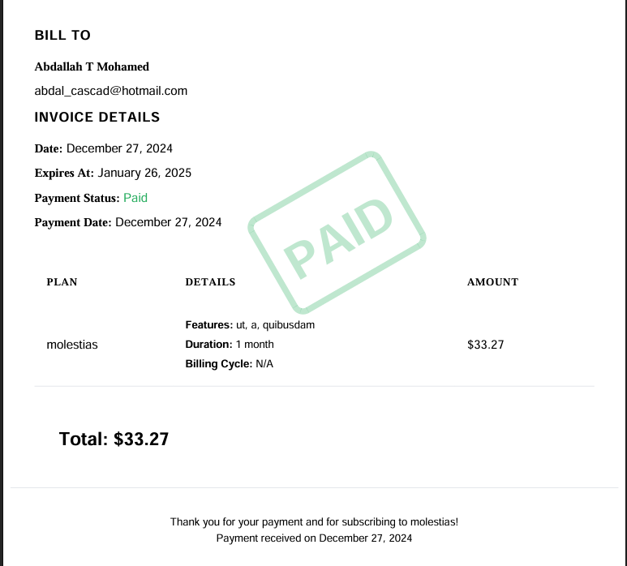

# OfflineCashier Documentation

OfflineCashier is a Laravel package that provides subscription and payment management with support for both offline and online payment methods.

## Features

- Subscription Management (create, cancel, resume, change plans)
- Multiple Payment Methods (cash, check, bank transfer, Stripe)
- Invoice Generation
- PDF Generation
- Email Notifications
- Stripe Integration
- Customizable Views
- Event System
- Automatic Feature Assignment: Automatically assigns features to subscriptions based on the selected plan.
- Customizable Feature Assignment: Provides a hook for developers to customize or override the default feature assignment logic.

## Table of Contents

1. [Installation](docs/installation.md)
2. [Configuration](docs/configuration.md)
3. [Basic Usage](docs/basic-usage.md)
4. [Payment Methods](docs/payment-methods.md)
5. [Events & Notifications](docs/events-notifications.md)
6. [Stripe Integration](docs/stripe-integration.md)
7. [Invoice Generation](docs/invoice-generation.md)
8. [Testing](docs/testing.md)

## Example Usage

Here's an example of how to use the `SubscriptionService` and `InvoiceService` within a Livewire component to manage subscriptions and payments:

```php
namespace App\Livewire\Subscription;

use Livewire\Component;
use AMohamed\OfflineCashier\Models\Plan;
use AMohamed\OfflineCashier\Models\Subscription;
use Illuminate\Support\Facades\Auth;
use AMohamed\OfflineCashier\Services\InvoiceService;
use Illuminate\Support\Facades\Log;
use AMohamed\OfflineCashier\Services\SubscriptionService;

class SubscriptionComponent extends Component
{
    public $plans;
    public $selectedPlan;
    public $paymentMethod = 'cash';
    public $referenceNumber;
    protected $invoiceService;
    protected $subscriptionService;

    public function __construct()
    {
        $this->invoiceService = new InvoiceService();
        $this->subscriptionService = new SubscriptionService();
    }

    public function mount()
    {
        $this->plans = Plan::with('features')->get();
    }

    public function selectPlan($planId)
    {
        $this->selectedPlan = Plan::find($planId);
    }

    public function subscribe()
    {
        $this->validate([
            'selectedPlan' => 'required',
            'paymentMethod' => 'required|in:cash,check,bank_transfer,stripe',
            'referenceNumber' => 'required_if:paymentMethod,cash,check,bank_transfer'
        ]);

        $subscription = $this->subscriptionService->create(Auth::user(), $this->selectedPlan, $this->paymentMethod);

        $payment = $subscription->payments()->create([
            'amount' => $this->selectedPlan->price,
            'payment_method' => $this->paymentMethod,
            'status' => 'completed',
            'reference_number' => $this->referenceNumber,
            'paid_at' => now(),
        ]);

        $this->invoiceService->generate($payment);

        session()->flash('message', 'Successfully subscribed to ' . $this->selectedPlan->name);

        $this->reset(['selectedPlan', 'paymentMethod', 'referenceNumber']);
    }

    public function render()
    {
        return view('livewire.subscription.subscription-component');
    }
}
```

## Visual Representation



This image illustrates the subscription creation process and feature assignment.

## Project Example

For a practical example of how to use the OfflineCashier package, check out this [GitHub repository](https://github.com/Abdallah-Tah/cashier). It demonstrates the implementation of the package in a real-world project.